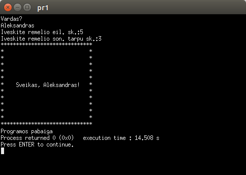

Programa turi nuskaito naudotojo vardą (pvz. Aleksandr) ir atspausdinti "įrėmintą" pasisveikinimą:

# [Versija 0.1](https://github.com/Igumenov-A/1-uzd./tree/v0.1)
Pirmoje eilutėje prasideda rėmelis, kuris yra simbolių * seka.
Rėmelio ilgis priklauso nuo: įvesto vartotojo vardo ilgio pasisveikinimo "Sveikas, " tarpo ir \* simbolio rėmelio pradžioje ir pabaigoje.
Antroji eilutė prasideda ir baigiasi \* simboliu, o vidus užpildytas reikiamu skaičiumi tarpo simbolių.
Trečioji eilutė susideda iš \*, tarpo, pasisveikinimo, tarpo ir \*.
Kervirta ir penkta eilutės bus analogiškos antrąjai ir pirmąjąi.

# [Versija 0.2](https://github.com/Igumenov-A/1-uzd./tree/v0.2)
Versija 0.1 praplesta:
Jeigu naudotojas yra moteris, tuomet vietoj "Sveikas, " rašytų "Sveika, ", kitaip "Sveikas, ". 

# [Versija 1.0](https://github.com/Igumenov-A/1-uzd./tree/v1.0)
Modifikuota versiją (v0.2).
* Visos eilutės saugomos struktūroje
* Nadotojas nurodo rėmelio plotį (eilučių skaičių) ir pasisveikinimas išliktų rėmelio viduje.

Opublikuotos versijos:
- [v0.1](https://github.com/Igumenov-A/1-uzd./releases/tag/v0.1)
- [v0.2](https://github.com/Igumenov-A/1-uzd./releases/tag/v0.2)
- [v1.0](https://github.com/Igumenov-A/1-uzd./releases/tag/v1.0)
